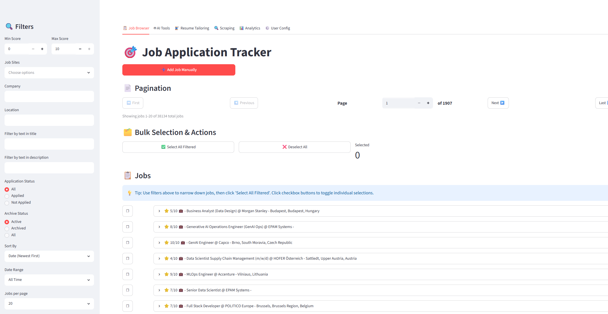
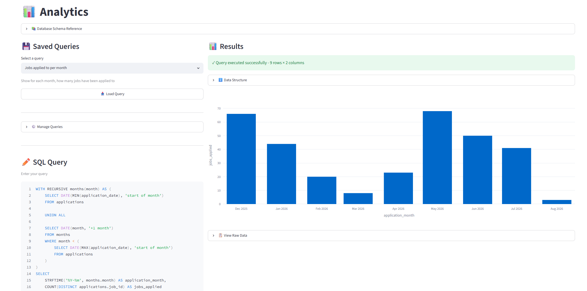
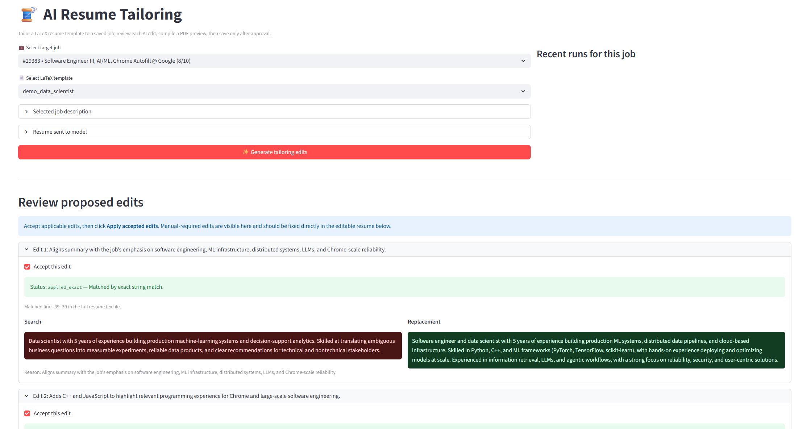

# Job Application Tracker


A LLM-assisted workspace for finding and evaluating jobs, as well as tracking job applications. It combines multi-site scraping, LLM scoring, application management, resume tailoring and analytics in a local Streamlit dashboard.


<p align="center">
  
</p>
## Quick Start

Requires Python 3.12 or newer and [uv](https://docs.astral.sh/uv/).
AI features require an OpenAI-compatible API.
Resume tailoring requires Tectonic or a TeX distribution providing latexmk; [Tectonic](https://tectonic-typesetting.github.io/) is recommended.


```bash
git clone https://github.com/Ni-co-la-s/job-application-tracker.git
cd job-application-tracker
uv sync
uv run streamlit run dashboard.py
```

On first launch, the dashboard creates missing local configuration files from their tracked `.example` templates. Open **User Config → LLM Settings** to configure models, API keys, and base URLs before using AI features.

## What It Does

- **Multi-site scraping:** Collect listings from Indeed, LinkedIn, Glassdoor, and ZipRecruiter.
- **Deduplication:** Use simhash fingerprints to avoid storing substantially identical jobs.
- **Automated evaluation:** Extract required skills, compare them with your profile, and score each job from 1–10 with written reasoning.
- **Job tracking:** Browse, archive, edit, and mark jobs as applied with the resume used.
- **AI tools:** Chat about job descriptions, test prompts, and tailor LaTeX resumes.
- **Resume registry:** Import your resumes for tracking which ones you use for applications.
- **Analytics:** Run saved or custom SQL queries and visualize the results to analyze your job searching process.

Scraping uses my [JobSpy fork](https://github.com/Ni-co-la-s/JobSpy), which adds LinkedIn company ID filtering to the original JobSpy functionalities.

### Analytics

Saved and custom SQL queries can be visualized directly in the dashboard.

<p align="center">
  
</p>

## Essential Configuration

Most configuration files can be edited directly from the dashboard.

| File | Purpose | Dashboard location |
|---|---|---|
| `.env` | Models, API keys, and OpenAI-compatible endpoints | User Config → LLM Settings |
| `config/resume.txt` | Your full experience context used for scoring and tailoring (passed as is to LLMs so if using cloud models, you should leave out information you don't want passed) | User Config → Profile Files |
| `config/candidate_skills.txt` | List of your skills used for heuristic matching | User Config → Profile Files |
| `config/searches.txt` | List of job searches performed by the scraper on chosen job boards | Scraping |
| `config/prompts.json` | Prompts used for extraction, matching, scoring, and tailoring | User Config → Prompts |
| `config/presets.json` | Saved prompt templates for your AI Chats | AI Tools |
| `config/queries.json` | Saved SQL queries used for visualization | Analytics |
| `config/interview_stages.json` | Interview stage definitions (ideally should not be changed) | Not available in dashboard |

### LLM Settings

Each pipeline stage has its own model configuration:

```env
SKILLS_EXTRACTION_MODEL=gpt-4.1-nano
SKILLS_EXTRACTION_API_KEY=sk-...
SKILLS_EXTRACTION_BASE_URL=https://api.openai.com/v1

SKILLS_MATCHING_MODEL=gpt-4.1-mini
SKILLS_MATCHING_API_KEY=sk-...
SKILLS_MATCHING_BASE_URL=https://api.openai.com/v1

JOB_SCORING_MODEL=gpt-4.1-mini
JOB_SCORING_API_KEY=sk-...
JOB_SCORING_BASE_URL=https://api.openai.com/v1

CHAT_MODEL=Qwen3 8B
CHAT_API_KEY= ...
CHAT_BASE_URL='http://localhost:8000/v1'

RESUME_TAILORING_MODEL=gpt-4o-mini
RESUME_TAILORING_API_KEY= ...
RESUME_TAILORING_BASE_URL=https://api.openai.com/v1
```

### Search Definitions

Add one search per line to `config/searches.txt`:

```text
job title|location|country
job title|location|country|linkedin_company_ids
```

Examples:

```text
SEO Specialist|Berlin|Germany
Data Scientist|European Union|worldwide|1441,1035
```

LinkedIn company IDs are optional comma-separated integers that allows having searches for specific companies for linkedin only. They can be found in LinkedIn job-search URLs, such as `f_C=1441`.
Since the scraping from linkedin also retrieves the company_ids, you can also try to retrieve them from your database.
LinkedIn and ZipRecruiter primarily use `location`; Indeed and Glassdoor also use `country`.
Indeed and LinkedIn are the recommended sources. ZipRecruiter is US-only and I have not tested it, while Glassdoor has had some parsing problems recently.

## Resume Management and Tailoring

Use **User Config → Resumes** to import your resumes as either:

- PDF resumes for application tracking;
- a standalone `resume.tex` entrypoint;
- a zipped LaTeX project containing one `resume.tex` entrypoint.

PDF resumes are copied to `Resumes/final/`. LaTeX projects are stored under `Resumes/tex/<template-name>/resume.tex`.

In zipped LaTeX projects, you can have `.cls`, `.sty`, font, image files... in addition to `resume.tex`. The tailoring workflow only edits `resume.tex`, so other content will not be accessible to the AI.

If you have some information in your resume that you do not want the LLM to access, optional PII redactions can be configured per template in:

```text
Resumes/tex/<template-name>/pii_redactions.txt
```

In this file, add one exact literal string per line that you want ignored.

For example

```text
John Smith
+1 0123456789 
john.smith@email.com
New-York
```

Redactions are applied to `resume.tex` before its content is sent to the configured tailoring model.

The tailoring interface shows each proposed search-and-replacement edit for individual review before it is applied:

<p align="center">
  
</p>

After tailoring, you can build the result as a PDF before saving it.
[Tectonic](https://tectonic-typesetting.github.io/) is recommended for the LaTeX engine and is required on path for the functionality to work.

Resumes that are not foreseen to be used again can be archived to not have them visible as an option when applying. 
Resumes that have not been used for an application can be deleted.


## Model recommandations

Since the different tasks have variable complexity, it is important to choose the models you use well. 
Currently, I use deepseek-v4-flash for skill extraction, skill matching, job scoring and chat since it is the most cost efficient option (in my workload, I have been able to process up to 2500 jobs for less than $1).
Reasoning it not really useful for everything except job scoring (and the model overthinks quite a bit with reasoning enabled so it is significantly more expensive).

Resume Tailoring is a way more difficult task, for it I currently use gpt-5.6.